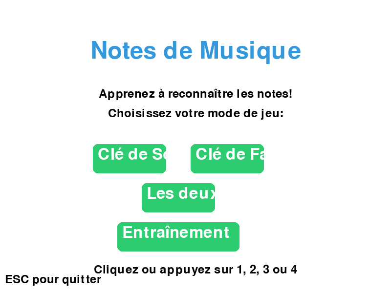
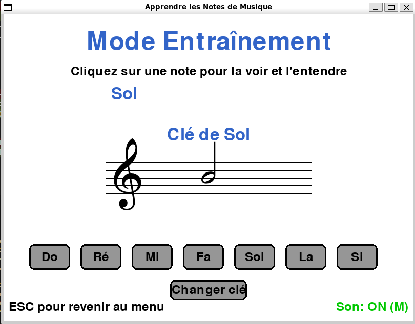

# 🎵 Jeu d'Apprentissage des Notes de Musique

Un jeu éducatif interactif développé avec Pygame pour apprendre à reconnaître les notes de musique sur une portée musicale.





## 🎮 Fonctionnalités

- **Deux clés musicales** : Clé de Sol et Clé de Fa avec symboles musicaux professionnels (police Bravura)
- **Quatre modes de jeu** :
  - Clé de Sol uniquement (octave 4)
  - Clé de Fa uniquement (octave 2-3, sons plus graves)
  - Mode mixte (alternance aléatoire)
  - **Mode entraînement** : Explorez les notes à votre rythme sans timer ni score
- **Sons réels des notes** : Génération synthétique avec fréquences authentiques
  - Clé de Sol : Do4 (261.63 Hz) à Si4 (493.88 Hz)
  - Clé de Fa : Sol2 (98 Hz) à Fa3 (174.61 Hz)
- **Contrôle du son** : Activer/désactiver à tout moment avec la touche M
- **Navigation fluide** : ESC retourne au menu depuis le jeu, quitte depuis le menu
- **Système de niveaux progressifs** : La difficulté augmente au fur et à mesure (modes jeu)
- **Interaction multiple** : Cliquez sur les boutons ou utilisez les touches 1-7
- **Retour visuel immédiat** avec messages de feedback colorés
- **Barre de temps dynamique** qui change de couleur selon l'urgence (modes jeu)
- **Score** qui évolue avec vos bonnes et mauvaises réponses (modes jeu)
- **Notation musicale authentique** : Noires professionnelles, lignes additionnelles correctes, symboles Bravura
- **Exécutables portables** pour Windows, Linux et macOS (aucune installation requise)

## 📋 Prérequis

### Pour l'exécutable (recommandé)
Aucun prérequis ! Les exécutables sont autonomes et incluent tout le nécessaire.

### Pour l'installation depuis les sources
- Python 3.7+
- Pygame 2.x
- NumPy

## 🚀 Installation

### Option 1 : Télécharger l'exécutable (Recommandé)

**Pas besoin d'installer Python !**

Téléchargez l'exécutable correspondant à votre système depuis la section [Releases](https://github.com/Kiwi41/music-learning-game/releases) :

- **Windows** : `MusicLearningGame-windows.exe`
- **Linux** : `MusicLearningGame-linux`
- **macOS** : `MusicLearningGame-macos`

**Lancement** :
- **Windows** : Double-cliquez sur le fichier
- **Linux/macOS** : `chmod +x MusicLearningGame-* && ./MusicLearningGame-*`

### Option 2 : Installation depuis les sources

1. Clonez le dépôt :
```bash
git clone https://github.com/Kiwi41/music-learning-game.git
cd music-learning-game
```

2. Installez les dépendances :
```bash
pip install pygame numpy
```

## 🔨 Compiler l'exécutable (optionnel)

### Build automatique via GitHub Actions ⭐

**Les exécutables sont buildés automatiquement !** À chaque tag `v*.*.*`, GitHub Actions crée automatiquement les 3 versions (Windows, Linux, macOS) et les publie dans les releases.

Pour créer une nouvelle release avec builds automatiques :
```bash
git tag v1.0.1
git push origin v1.0.1
```

### Build manuel (si nécessaire)

#### Sur Linux/macOS :

1. Installez PyInstaller :
```bash
pip install pyinstaller
```

2. Lancez le script de build :
```bash
./build.sh
```

3. L'exécutable sera créé dans le dossier `dist/`

#### Sur Windows :

**Important** : Ne pas utiliser depuis WSL! Clonez le projet directement sur Windows (ex: `C:\Users\...\music-learning-game`)

1. Installez Python et les dépendances :
```cmd
pip install pygame numpy pyinstaller
```

2. Lancez le script de build :
```cmd
build.bat
```

3. L'exécutable `MusicLearningGame.exe` sera créé dans le dossier `dist\`

## 🎯 Comment jouer

### Si vous avez téléchargé l'exécutable :

- **Windows** : Double-cliquez sur `MusicLearningGame-windows.exe`
- **Linux** : Ouvrez un terminal et lancez :
  ```bash
  chmod +x MusicLearningGame-linux
  ./MusicLearningGame-linux
  ```
- **macOS** : Ouvrez un terminal et lancez :
  ```bash
  chmod +x MusicLearningGame-macos
  ./MusicLearningGame-macos
  ```

### Si vous avez installé depuis les sources :

```bash
python music_game.py
```

### Dans le jeu :

1. **Menu principal** : Choisissez votre mode
   - Cliquez sur un bouton ou appuyez sur 1, 2, 3 ou 4

2. **Mode Entraînement** :
   - Cliquez sur une note (Do à Si) pour la voir positionnée sur la portée et l'entendre
   - Bouton "Changer clé" pour basculer entre clé de Sol et clé de Fa
   - Pas de timer, pas de score : apprenez à votre rythme
   - Idéal pour se familiariser avec les positions des notes

3. **Modes Jeu (Sol, Fa, Mixte)** :
   - Une note apparaît sur la portée musicale et son son est joué automatiquement
   - Identifiez-la en cliquant sur le bouton correspondant ou en utilisant les touches 1-7
   - Les 7 notes : Do (1), Ré (2), Mi (3), Fa (4), Sol (5), La (6), Si (7)
   - Répondez avant que le temps ne s'écoule !
   - Appuyez sur M pour activer/désactiver le son

4. **Progression (modes jeu)** :
   - +10 points × niveau pour chaque bonne réponse
   - -5 points pour chaque erreur ou temps écoulé
   - Le niveau augmente tous les 50 points
   - Le temps de réponse diminue à chaque nouveau niveau

## ⌨️ Commandes

- **Touches 1-7** : Sélectionner une note (Do à Si)
- **Touche 4** : Mode entraînement (depuis le menu)
- **Clic souris** : Cliquer sur les boutons
- **M** : Activer/Désactiver le son
- **ESC** : Retour au menu (depuis le jeu/entraînement) ou quitter (depuis le menu)

## 🎨 Captures d'écran

### Menu Principal


Choisissez votre mode : Clé de Sol, Clé de Fa, Mode Mixte, ou Entraînement.

### Jeu en cours


Le jeu affiche :
- Une portée musicale authentique avec 5 lignes
- La clé actuelle (Sol 𝄞 ou Fa 𝄢) avec symboles musicaux professionnels
- Notes rondes parfaitement dessinées avec lignes additionnelles correctes
- Un système de score et niveau en temps réel (modes jeu)
- Une barre de progression temporelle (modes jeu)
- Sept boutons interactifs avec effet de survol (Do, Ré, Mi, Fa, Sol, La, Si)
- Un indicateur visuel de l'état du son (ON/OFF)
- Mode entraînement : interface épurée pour explorer les notes librement

## 🛠️ Technologies utilisées

- **Python 3** : Langage de programmation
- **Pygame** : Bibliothèque de jeu 2D
- **NumPy** : Génération synthétique des sons musicaux
- **PyInstaller** : Création d'exécutables portables
- **GitHub Actions** : Build automatique multi-plateforme (CI/CD)
- **Police Bravura** : Symboles musicaux professionnels (Steinberg)

## 📝 Licence

Projet personnel à but éducatif.

## 👤 Auteur

Kiwi41

---

Bon apprentissage musical ! 🎼
